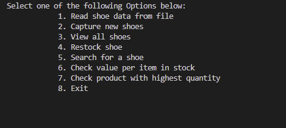

# Inventory Management System
A Python program for managing inventory data. The program reads from the text file inventory.txt and performs various actions on the data. The program makes use of a class named Shoes to represent each item in the inventory and a list to store these Shoe objects.

## Table of Contents
* [Overview](#overview)
* [Installation](#installation)
* [Usage](#usage)
* [Credits](#credits)

The Shoes class has the following attributes:

* country
* code
* product
* cost
* quantity
The class also defines the following methods:

* get_cost: Returns the cost of the shoes.
* get_quantity: Returns the quantity of the shoes.
* __str__: Returns a string representation of the class.
The program also defines the following functions:

* read_shoes_data: Reads data from the inventory.txt file and creates a Shoe object for each line of data in the file.
* capture_shoes: Allows a user to capture data about a shoe and create a new Shoe object.
* view_all: Prints details of all the shoes in the inventory.
* re_stock: Finds the shoe with the lowest quantity and allows the user to add more of this shoe to the inventory.
* search_shoe: Searches for a shoe in the inventory using the shoe code.
* value_per_item: Calculates the total value of each item in the inventory.
* highest_qty: Determines the product with the highest quantity.

## Installation
To run the Inventory Management System, simply clone the repository and run the inventory.py file using Python 3.

## Usage
Upon running the program, a menu will be displayed that allows you to execute each of the functions defined above.

## Credits
This project was created by Charles-Spencer Coleman.